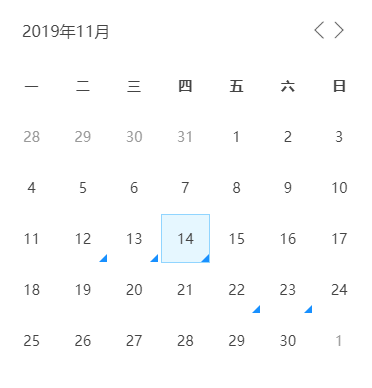

# Vue-Calendar
A event calendar component for Vue



### Features
- Display events

### Installation
```
npm install vue-calendar
# or
yarn add vue-calendar
```
### Usage
```
import Calendar from 'vue-calendar'
import 'e-calendar/lib/e-calendar.css'

components: {
    Calendar
},
data() {
    return {
        date: {}
    }
},
```

```
<template>
  <Calendar v-model="date" />
</template>
```
